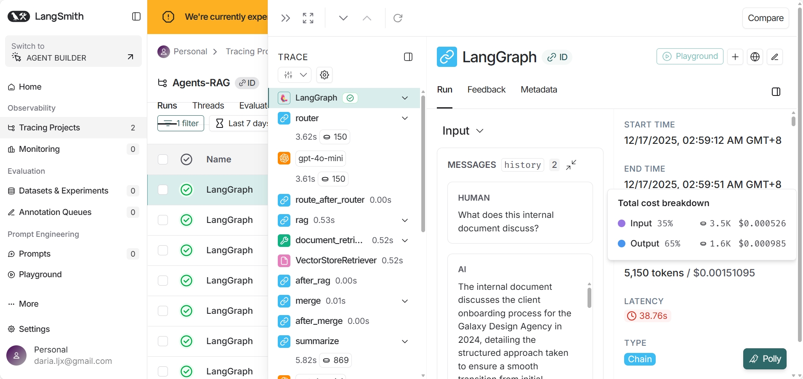
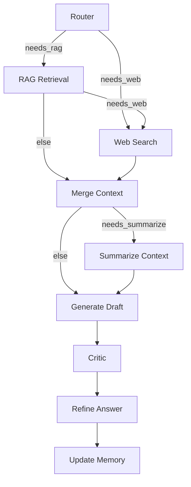

# 🧠 Multi-Tool Agentic RAG System

### *(LangGraph · LangChain · Tavily · FAISS · FastAPI · Streamlit · LangSmith)*

A **production-oriented Agentic AI system** built with **LangGraph** and **LangChain**, featuring **multi-tool orchestration**, **RAG**, **web search via Tavily**, **summarization**, **self-reflection**, **conversation memory**, and **full observability**.

This project demonstrates how an LLM can **reason about user intent, select tools dynamically, and coordinate multiple tools** within an explicit, debuggable agent workflow.

---

## ✨ Key Features

### 🔁 Multi-Tool Agent Orchestration

The agent does **not blindly call all tools**.
Instead, an **LLM-based Router Agent** decides:

* which tools are needed
* in what order they should be executed
* whether summarization is required

Supported tools:

* **RAG Tool** – internal document retrieval using FAISS
* **Web Search Tool (Tavily)** – reliable external knowledge augmentation
* **Summarizer Tool** – condenses long contexts
* **LLM Reasoning Tool** – final answer generation

---

### 🧩 Multi-Agent Workflow (LangGraph)

The system is implemented as an explicit **LangGraph state machine**, where each node has a single responsibility:

* **Router Agent** – intent analysis & tool selection
* **RAG Agent** – internal document retrieval
* **Web Agent (Tavily)** – external knowledge search
* **Summarizer Agent** – context compression
* **Answer Agent** – draft response generation
* **Critic Agent** – hallucination & gap detection
* **Refiner Agent** – answer improvement
* **Memory Agent** – conversation state update

This design makes the agent **interpretable, controllable, and production-ready**.

---

## 🖥️ Streamlit UI Demo

The project includes a **ChatGPT-style Streamlit interface** with clear separation of **user and assistant messages**, supporting multi-turn conversations and optional debugging panels.

### Features:

* Distinct chat bubbles for user and assistant
* Conversation memory across turns
* Real-time agent execution feedback

📸 **Streamlit Screenshot**


---

## 🔍 Observability & Debugging (Three Layers)

This project emphasizes **observability**, which is critical for real-world Agent systems.

### 1️⃣ Console Logging

Structured logging is enabled across all agent nodes:

* Router decisions
* Tool execution
* Error handling and fallbacks

Example:

```text
[INFO] [src.agent.run_agent] [run_agent] query=What does this internal document discuss?
[INFO] [src.agent.nodes] [Router] raw=["rag"]
[INFO] [src.agent.nodes] [RAG] running rag_search
[INFO] [src.agent.nodes] [Answer] generating draft
[INFO] [src.agent.nodes] [Critic] critiquing draft
[INFO] [src.agent.nodes] [Refine] refining answer
```

---

### 2️⃣ Streamlit Visual Debugging

Within the Streamlit app:

* Tool plans can be expanded and inspected
* Agent behavior can be observed interactively
* Errors are surfaced clearly without crashing the app

---

### 3️⃣ LangSmith Tracing

The entire agent workflow is traced using **LangSmith**, providing:

* Full node-level execution traces
* Inputs / outputs per agent step
* Prompt inspection
* Latency and token usage analysis

📸 **LangSmith Trace Screenshot**



---

## 🧠 Agent Workflow (Simplified View)

Below is a **logic-level view** of the agent workflow (abstracted from execution details):



---

## 🗂 Project Structure

```text
src/
├── agent/
│   ├── graph_state.py      # TypedDict state definition
│   ├── prompts.py          # Prompts for router, answer, critic, refiner
│   ├── nodes.py            # Agent nodes (router, rag, web, summarize, etc.)
│   ├── rag_graph.py        # LangGraph workflow definition
│   └── run_agent.py        # High-level agent execution API
│
├── tools/
│   ├── retriever_tool.py   # FAISS-based RAG tool
│   ├── web_search_tool.py  # Tavily web search tool
│   └── summarizer_tool.py  # LLM-based summarization tool
│
├── data/
│   ├──raw /                # Original documents
│   ├── clean_text.py      
│   └── load_docs.py
|
├── rag/
│   ├── (faiss_store)/        # FAISS vector store files
│   ├── build_vectorstore.py      
│   └── embeddings.py
│
├── utils/
│   ├── constants.py
│   └── logger.py
│
├── app/
│   ├── fastapi_app.py      # REST API service
│   └── streamlit_app.py    # Chat-style UI
│
├── main.py                 # CLI entry point
└── requirements.txt
```

---

## 🚀 How to Run

### 1️⃣ Install Dependencies

```bash
pip install -r requirements.txt
```

---

### 2️⃣ Environment Variables (`.env`)

```env
OPENAI_API_KEY=your_api_key

# Tavily Web Search
TAVILY_API_KEY=your_tavily_key

# LangSmith Observability
LANGCHAIN_TRACING_V2=true
LANGCHAIN_API_KEY=your_langsmith_key
LANGCHAIN_PROJECT=MultiTool-Agentic-RAG
```

---

### 3️⃣ Run FastAPI Backend

```bash
uvicorn src.app.fastapi_app:app --reload
```

---

### 4️⃣ Run Streamlit UI

```bash
streamlit run src/app/streamlit_app.py
```


---

## 📌 Assets Directory

```text
assets/
├── streamlit_demo.png
└── langsmith_trace.png
```
